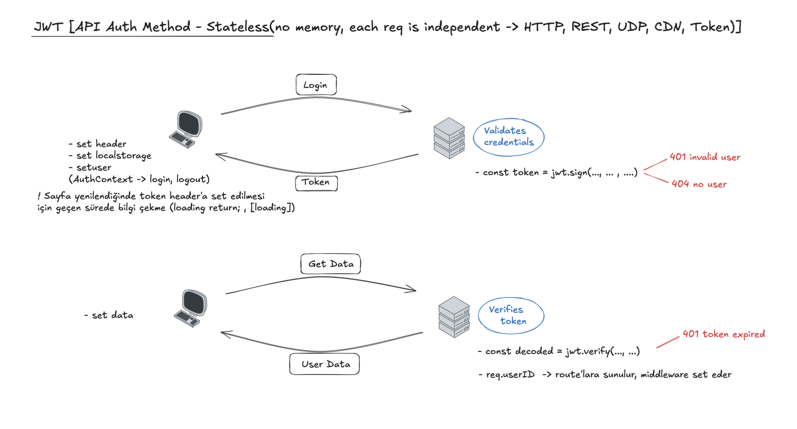
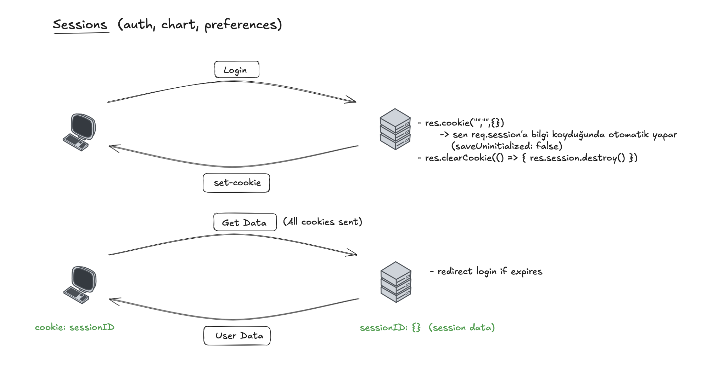

# 🚀 JWT 

Guide that I get help: 
<br>
Frontend: [React Authentication With JWT](https://medium.com/@coderskamrul/react-authentication-with-jwt-30d57dc4cd6f) 
<br>
Backend: [JWT Authentication in Node.js](https://dvmhn07.medium.com/jwt-authentication-in-node-js-a-practical-guide-c8ab1b432a49)

| Çizim-1 | Çizim-2 |
|-------|----|
|  |  |


## Notes for Myself 

### React useContext:
Create:
```jsx
const userContext = createContext();
```

Provide:
```jsx
<UserContext.Provider value={user}>
    <h1>Welcome to the App</h1>
    <Dashboard /> 
</UserContext.Provider>
```

Consume:
```jsx
const user = useContext(UserContext);
return (
    <div style={{ border: '1px solid grey', padding: '10px' }}>
        <h2>User Profile</h2>
        <p>Current User: <strong>{user}</strong></p>
    </div>
);
```
---
### View:
````js
.html -> res.sendfile() 
.ejs ->  res.render()
````
---
### Middlewares:
```js
app.use(mw, require())   [all]
app.post(mw, require())   [just post]
app.post(”/”, mw, …)   [one]
```
---
- Supabase policy → does not give error just doesnt return anything !!
